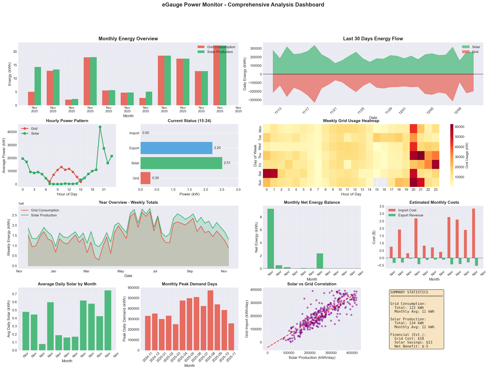

# eGauge Power Analysis

Comprehensive power monitoring and analysis system for eGauge energy monitors. This project provides tools to fetch, analyze, and visualize energy consumption and solar production data from eGauge devices.

## Features

- **Real-time Power Monitoring**: Fetch instantaneous power readings from eGauge devices
- **Historical Data Analysis**: Analyze hourly, daily, and monthly energy patterns
- **Solar Production Tracking**: Monitor solar panel performance and efficiency
- **Grid Usage Analysis**: Track grid import/export and net energy consumption
- **Cost Analysis**: Estimate energy costs and solar savings
- **Comprehensive Visualizations**: Generate detailed dashboards with multiple chart types
- **Pattern Recognition**: Identify peak usage hours and seasonal variations

## Screenshots



## Installation

### Prerequisites

- Python 3.9 or higher
- eGauge device accessible on your network
- Network access to eGauge device (default port 80)

### Setup

1. Clone the repository:
```bash
git clone https://github.com/yourusername/egauge-power-analysis.git
cd egauge-power-analysis
```

2. Install required packages:
```bash
pip3 install -r requirements.txt
```

3. Configure your eGauge IP address in the scripts (default: `10.10.20.241`)

## Usage

### Quick Test
Test connectivity to your eGauge device:
```bash
python3 src/egauge_test.py
```

### Complete Analysis
Run the comprehensive analysis with visualizations:
```bash
python3 src/egauge_complete_analysis.py
```

This will generate:
- Detailed console report with statistics
- Comprehensive dashboard visualization (PNG file)
- Analysis of:
  - Monthly energy patterns
  - Daily consumption trends
  - Hourly usage patterns
  - Solar production efficiency
  - Cost analysis
  - Peak demand analysis

### Alternative Analysis Scripts

- `src/egauge_analysis.py` - Initial analysis script with basic features
- `src/egauge_full_analysis.py` - Extended analysis with additional metrics

## Configuration

### eGauge Device Settings

Edit the IP address in any script:
```python
EGAUGE_IP = "10.10.20.241"  # Change to your eGauge IP
```

### Cost Rates

Adjust electricity rates for accurate cost analysis:
```python
import_rate = 0.15  # $/kWh for grid import
export_rate = 0.08  # $/kWh for solar export
```

## Data Registers

The scripts read the following eGauge registers:
- **Grid**: Total grid consumption
- **Grid+**: Grid import counter
- **Solar**: Total solar production
- **Solar+**: Solar generation counter
- **Grid_Incoming**: Instantaneous grid import
- **Grid_Outgoing**: Instantaneous grid export
- **Cost ToC**: Time-of-use cost tracking

## Output Files

The analysis generates:
- **PNG Dashboard**: Comprehensive visualization with 12+ charts
- **Console Report**: Detailed statistics and metrics

Example output filename: `egauge_complete_20251109_152447.png`

## Dashboard Components

The generated dashboard includes:

1. **Monthly Energy Overview**: Bar chart comparing grid consumption and solar production
2. **Last 30 Days Energy Flow**: Area chart showing daily energy balance
3. **Hourly Power Pattern**: Line graph of average hourly usage
4. **Current Status Gauge**: Real-time power flow visualization
5. **Weekly Grid Usage Heatmap**: Hour-by-day usage intensity map
6. **Year Overview**: Weekly energy totals over the year
7. **Monthly Net Energy Balance**: Net import/export by month
8. **Estimated Monthly Costs**: Financial analysis with import costs and export revenue
9. **Average Daily Solar by Month**: Solar efficiency across seasons
10. **Monthly Peak Demand Days**: Highest consumption days per month
11. **Solar vs Grid Correlation**: Scatter plot showing relationship
12. **Summary Statistics**: Key metrics and financial summary

## API Endpoints Used

The scripts use eGauge's XML API:
- `/cgi-bin/egauge?inst` - Instantaneous power readings
- `/cgi-bin/egauge?tot` - Total accumulated values
- `/cgi-bin/egauge-show?h&n=X` - Hourly data (X hours)
- `/cgi-bin/egauge-show?d&n=X` - Daily data (X days)
- `/cgi-bin/egauge-show?m&n=X` - Monthly data (X months)

## Authentication

No authentication required if your eGauge has public access enabled for local network connections. For secure deployments, consider:
- Enabling digest authentication on eGauge
- Using the `egauge-python` library's JWTAuth class
- Restricting network access to trusted devices

## Troubleshooting

### Connection Issues
1. Verify eGauge is accessible: `ping 10.10.20.241`
2. Check web interface: `http://10.10.20.241`
3. Ensure firewall allows HTTP access (port 80)

### No Data Returned
1. Verify eGauge has historical data stored
2. Check register names match your configuration
3. Ensure time periods requested are within data range

### Import Errors
1. Install missing packages: `pip3 install -r requirements.txt`
2. Upgrade pip: `pip3 install --upgrade pip`
3. Check Python version: `python3 --version` (requires 3.9+)

## Future Enhancements

- [ ] Home Assistant integration
- [ ] Real-time monitoring dashboard
- [ ] Email/SMS alerts for anomalies
- [ ] Machine learning for usage prediction
- [ ] Export data to CSV/Excel
- [ ] Web-based dashboard interface
- [ ] Multi-device support
- [ ] Weather correlation analysis
- [ ] Battery storage integration
- [ ] Time-of-use rate optimization

## Contributing

Contributions are welcome! Please feel free to submit a Pull Request.

## License

MIT License - see LICENSE file for details

## Author

Created by Claude with human collaboration

## Acknowledgments

- eGauge Systems for their robust energy monitoring platform
- Python data science community for excellent visualization libraries

## Support

For issues or questions:
1. Check the troubleshooting section
2. Review eGauge documentation at https://www.egauge.net/
3. Open an issue in this repository

## Version History

- **1.0.0** (2025-11-09): Initial release with comprehensive analysis features